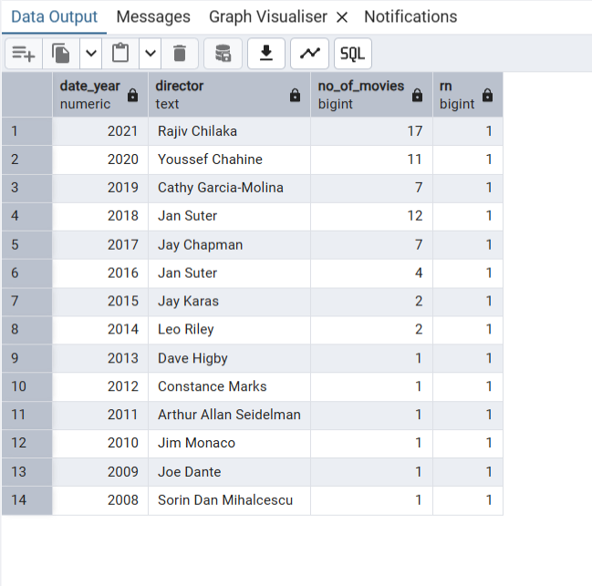

# Netflix-Data-Cleaning-and-Analysis

## Overview

This project focuses on building an data pipeline to analyze Netflix Dataset from Kaggle. We use Python and Jupyter Notebook to load to database. The raw data is stored in PostgreSQL and then data cleaning and in-depth analysis with sql. 

## Table of Contents
- [Overview](#overview)
- [Architecture](#architecture)
- [Dataset Used](#dataset-used)
- [Step in This Project](#step-in-this-project)
- [Results](#results)

## Architecture

### Tech Stacks
1. Programming Language - Python
2. Jupyter Notebook
3. PostgreSQL

## Dataset Used
Netflix Movies and TV Shows

Netflix is one of the most popular media and video streaming platforms. They have over 8000 movies or tv shows available on their platform, as of mid-2021, they have over 200M Subscribers globally. This tabular dataset consists of listings of all the movies and tv shows available on Netflix, along with details such as - cast, directors, ratings, release year, duration, etc. 

More info about dataset : https://www.kaggle.com/datasets/shivamb/netflix-shows

## Step in This Project
1. Download and extract data 
2. Load into PostgreSQL 
3. Transform data
    1. Change datatype in raw netflix table
        - Change each string columns length to max length from data
        - Add primary constraints show_id column
        - delete and re-create netflix table
    2. Cleaning Data
        - Remove duplicates data (title & type)
        - Normalization (separate table -> director, cast, country, listed_in)
        - Convert data_added to datetime datatype
        - Drop seperate column 
    3. Handling Missing Values
        - Find what columns have null values
        - Populate director to fill null in country
        - Populate rating to fill null in duration
        - Create final table
4. Analysis Data
    1.	For each director count the number of movies and tv shows created by them in separator columns for directors who have created tv shows and movies both
    2.	Which country has the highest number of comedy movies
    3.	For each year (as per date added to Netflix), which director has maximum number of movies released
    4.	What is the average duration of movies in each genre
    5.	Find the list of directors who have created horror and comedy movies both. Display director names along with number of comedy and horror movies directed by them

## Results
1. For each director count the number of movies and tv shows created by them in separator columns for directors who have created tv shows and movies both

2. Which country has the highest number of comedy movies

3. For each year (as per date added to Netflix), which director has maximum number of movies released

4. What is the average duration of movies in each genre

5. Find the list of directors who have created horror and comedy movies both. Display director names along with number of comedy and horror movies directed by them

